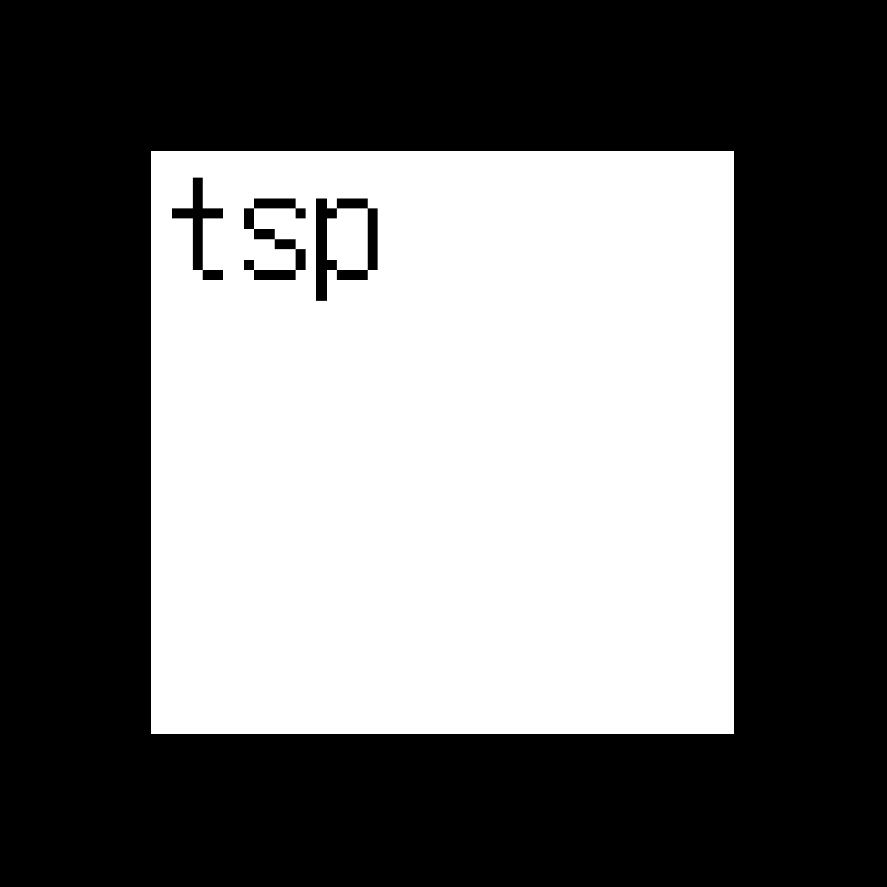
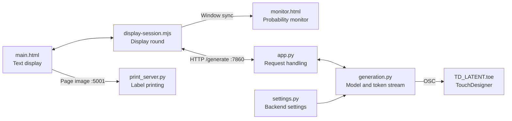

<p align="center">
  
</p>

# The Side Project

A generative text installation using [Qwen3 0.6B Base](https://huggingface.co/Qwen/Qwen3-0.6B-Base). A random character becomes a stream of text, displayed one token at a time in a white square. The model keeps only a small window of its own output as context and continues predicting what comes next.

This piece exists in dialogue with [Complimentary Machine](https://yanqihe.com/complimentary_machine). Where the latter is an over-aligned instruct model that only flatters and pleases, *The Side Project* uses a base model without a chat template or system prompt — a machine's monologue to itself.

## The loop

1. Start with a random uppercase letter or digit.
2. Predict and sample the next token using the most recent 10 tokens as context.
3. Display it, then feed it back into the next prediction. Special tokens such as `<|endoftext|>` remain visible; they do not stop the loop.
4. Start a new stream when the square fills up or someone clicks or taps it. Each new stream picks a new temperature: higher temperatures also produce shorter pauses between tokens.

Resizing keeps the square fitted to the window and restarts generation only if the text overflows. Independently, the backend flushes its context after 4,000 generated tokens and starts from another random character.

## Project structure

The browser manages the display; the Python backend runs the model. Printing and TouchDesigner are optional outputs. The project uses plain HTML, browser JavaScript modules, and Python, with no frontend build step.

```text
sideproject-standalone/
├── main.html                    # The white square: layout, interaction, page capture
├── monitor.html                 # Candidate tokens, probabilities, flicker animation
├── display-session.mjs          # One display round: settings, restart, window sync
├── app.py                       # HTTP entry point and model startup
├── generation.py                # Model loading, token generation, pacing, OSC output
├── settings.py                  # Model, sampling, memory-flush and OSC settings
├── print_server.py              # Optional Brother label printer backend
├── TD_LATENT.toe                # TouchDesigner project
├── public/                      # Logo, display font, and other static assets
├── tests/
│   ├── display-session.test.mjs  # Stream reception and display-round behavior
│   ├── display-pages.test.mjs    # Main/monitor pages and finished-page capture
│   └── test_backend.py          # Generation, HTTP requests, startup and OSC failures
├── CONTEXT.md                   # Project vocabulary
├── requirements.txt             # Python dependencies
└── readme.md                    # Setup, settings, and this guide
```

Local `.venv/`, `cache/` (including downloaded model weights), and `__pycache__/` directories are ignored by Git.

### How the parts connect



- **One round, two views.** Both pages import `display-session.mjs`. The main page starts the model request; the monitor observes the same round and can join midway. This module runs inside the browser and does not need another server.
- **One loaded model, separate streams.** `app.py` loads the generation engine once during startup. `generation.py` owns model loading, sampling, each request's text context and pause, and OSC output. Importing the code does not load weights or run calibration; model or calibration failures prevent startup from completing.
- **Independent outputs.** The main page freezes the finished square for background printing before starting the next round. OSC send failures are logged without stopping text generation.

## Run locally

Use Python 3.12. The backend automatically selects Apple Silicon MPS, NVIDIA CUDA, or CPU, in that order.

### 1. Start the model

From the repository directory:

```bash
python3.12 -m venv .venv
source .venv/bin/activate
pip install -r requirements.txt
HF_HOME="$PWD/cache/huggingface" python -m uvicorn app:app --host 127.0.0.1 --port 7860
```

The first run downloads `Qwen/Qwen3-0.6B-Base` into the ignored `cache/` directory. Later runs reuse the weights. Wait for the model and PCA calibration to finish and the server to report that it is running.

### 2. Open the display

In a second terminal, from the same directory:

```bash
.venv/bin/python -m http.server 8080 --bind 127.0.0.1
```

Open **[the text display](http://localhost:8080/main.html)**. Generation starts automatically; click or tap the white square to restart it.

Use the HTTP address above rather than opening the HTML file directly: the pages import browser modules that need to be served over HTTP.

Optionally open **[the probability monitor](http://localhost:8080/monitor.html)** in another tab or window of the same browser. It shows the current token, the top five sampling candidates and their probabilities, and the stream's temperature, context length, and requested delay. You can open it at any time: it joins the current display round and receives its latest token and settings automatically.

Both pages must use the same origin, including hostname and port, because they communicate through `BroadcastChannel`. Use one generating display with its companion monitor windows per origin.

## Current settings

The table includes the display's chosen values from `display-session.mjs` and the model settings from `settings.py`. Direct `/generate` requests default to temperature 1.0, context 64, delay 0.05 seconds, and an OSC reset.

| Setting | Value | Where to change it |
| --- | --- | --- |
| Model | `Qwen/Qwen3-0.6B-Base` | `MODEL_DIR` in `settings.py` |
| Initial seed | One character from `A–Z` or `0–9` | `SEEDS` in `settings.py` |
| Sliding context | 10 tokens | `CONTEXT` in `display-session.mjs` |
| Temperature | Random value from 0.5 to 1.5 per new stream | `TEMP_MIN`, `TEMP_MAX` in `display-session.mjs` |
| Pause between tokens | 1.0 s at temperature 0.5; 0.1 s at temperature 1.5, interpolated linearly | `DELAY_MIN`, `DELAY_MAX` in `display-session.mjs` |
| Top-p sampling | 0.92 | `TOP_P` in `settings.py` |
| Special tokens | Visible in text and candidate lists | `skip_special_tokens=False` in `generation.py` |
| Backend context reset | After 4,000 generated tokens | `MAX_TOKENS_BEFORE_RESET` in `settings.py` |

The backend uses the `delay` supplied with each `/generate` request. The actual interval also includes inference and other processing time; the monitor displays the requested pause, not a measured token interval. If the backend is on another machine, update `API_URL` in `main.html` and bind the backend to an appropriate network interface.

Restart the model backend after editing `settings.py`. The obsolete `/set-delay` route has been removed; set the pause on each `/generate` request instead. Requests require a positive finite temperature, a context of at least one token, and a nonnegative finite delay. The requested pause is clamped to 0.01–2 seconds.

## Installation connections

### TouchDesigner / OSC

`generation.py` projects the last input token's final-layer hidden state into three dimensions using PCA and sends OSC messages alongside generation. Set `OSC_TARGET_IP` and `OSC_TARGET_PORT` in `settings.py` to match the receiver. The repository includes [TD_LATENT.toe](TD_LATENT.toe).

| OSC address | Payload |
| --- | --- |
| `/latent/point` | Generated token text, x, y, z, token count |
| `/reset` | Integer reset signal |

OSC send errors are logged without stopping the text stream, and later tokens retry sending. A successful UDP send does not confirm that TouchDesigner received it. The HTTP `/reset` route only sends an OSC reset; it does not restart text generation, and returns 503 if sending is unavailable.

### Label printing

[print_server.py](print_server.py) provides the optional Brother QL printing service on port 5001. Before using a printer, set `PRINTER_MODEL` and `PRINTER_IDENTIFIER` to match the connected hardware; USB access and drivers depend on the operating system.

In the activated environment:

```bash
pip install flask flask-cors
python print_server.py
```

Start the print service before opening or reloading the text display. The display checks for it at startup and, when available, freezes a copy of the previous square before clearing it. Screenshot capture and printing run in order in the background while the new display round continues. Capture uses `html2canvas` loaded from a CDN. Without the print service, text generation still runs and printing is skipped.

## Where to change things

| Change | File |
| --- | --- |
| Square appearance, size, clicks, screenshots, or backend addresses | [main.html](main.html) |
| Candidate layout and flicker animation | [monitor.html](monitor.html) |
| Per-round temperature and speed, restart behavior, or monitor synchronization | [display-session.mjs](display-session.mjs) |
| Model choice, sampling cutoff, memory-flush limit, or OSC destination | [settings.py](settings.py) |
| How the model loads, generates tokens, retains context, or sends latent points | [generation.py](generation.py) |
| HTTP requests, validation, responses, or startup | [app.py](app.py) |
| Printer connection and label image processing | [print_server.py](print_server.py) |
| TouchDesigner visualization | [TD_LATENT.toe](TD_LATENT.toe) |
| Logo or display font | [public/tsp_logo.png](public/tsp_logo.png), [public/unifont.otf](public/unifont.otf) |

Project terms, including the distinction between a display round and a memory flush, are defined in [CONTEXT.md](CONTEXT.md).

## Checks

Run the browser behavior tests with Node.js 22 or newer. Node is only needed for these tests, not to run the display:

```bash
node --test tests/*.test.mjs
```

These cover fragmented text, rapid restarts, overflow, late monitor joins, and page preservation without loading the model or using a printer.

Run the backend behavior tests in the activated Python environment:

```bash
python -m unittest discover -s tests -p 'test_*.py' -v
```

They use a tiny in-memory model with real tensor sampling, plus a recording OSC sender. They cover streaming responses, special tokens, top-p and temperature, context windows, independent pauses, memory flushes, OSC failure/recovery, request validation, and startup failures without downloading weights or contacting TouchDesigner. These checks do not verify physical printing or the TouchDesigner receiver; check those with the installation hardware connected.
